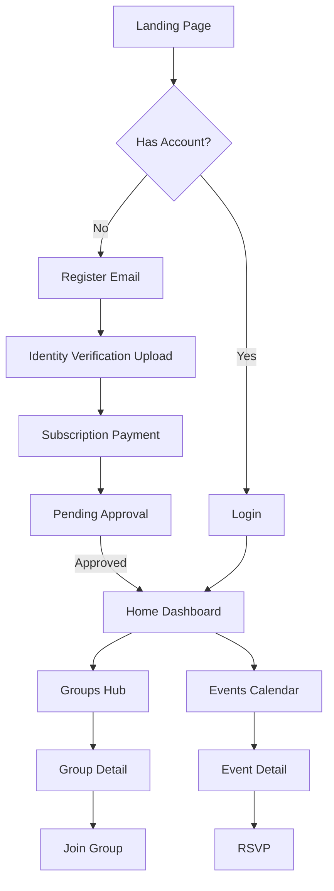

# Product Requirements Document: TrustNet

## 1. Product Overview
TrustNet is a privacy-first, subscription-based social networking platform designed for authentic local and interest-based connections. It eliminates bots and catfishing through mandatory government ID verification and fosters meaningful offline interactions by replacing vanity metrics (likes/views) with event-based engagement.

## 2. Core Features

### 2.1 User Roles
| Role | Registration Method | Core Permissions |
|------|---------------------|------------------|
| **Guest/Pending** | Email sign-up | Can access verification flow and subscription payment only. Cannot view content. |
| **Verified Member** | ID + Selfie verification & Subscription | Full access: join groups, organize events, view profiles, message. |
| **Moderator** | Admin appointment | Review flagged content, manage disputes, verify identity documents (if manual). |

### 2.2 Feature Module
Our requirements consist of the following main pages:
1.  **Landing & Auth**: Value proposition, secure login, registration, identity verification flow, subscription checkout.
2.  **Home Dashboard**: A finite, calm feed showing updates from joined groups and upcoming events (no algorithmic doom-scrolling).
3.  **Groups Hub**: Discovery of local or interest-based communities and detailed group views.
4.  **Events Calendar**: Creation and management of offline meetups and events.
5.  **User Profile**: Identity badge display, privacy settings, data export.

### 2.3 Page Details
| Page Name | Module Name | Feature description |
|-----------|-------------|---------------------|
| **Landing & Auth** | Identity Verification | Multi-step process requiring Government ID upload and a live selfie. Blocks access until approved. |
| | Subscription Gate | Secure payment processing interface (Stripe/similar placeholder) for monthly/yearly access. |
| **Home Dashboard** | "Calm" Feed | Chronological list of updates from joined groups. Pagination enabled (no infinite scroll). No public like counts. |
| | Notification Center | Alerts for event RSVPs and group announcements only. |
| **Groups Hub** | Discovery | Search and filter groups by location and interest tags. |
| | Group Detail | Discussion board, member list (verified only), and group-specific events. |
| **Events Calendar** | Event Management | Create events with location, time, and max capacity. RSVP functionality. |
| | Event Detail | Map view, attendee list, private event chat. |
| **User Profile** | Privacy Control | Settings to toggle visibility. Option to download all user data (GDPR compliance). |
| | Trust Badge | Visual indicator of verified status (e.g., "Verified Human"). |

## 3. Core Process
### Main User Flow
1.  User registers with email.
2.  User completes mandatory ID verification and pays subscription.
3.  Upon approval, User enters Home Dashboard.
4.  User joins an Interest Group.
5.  User RSVPs to an offline Event.

## 4. User Interface Design
### 4.1 Design Style
-   **Primary Colors**: Trust Blue (#0F4C81) and Calming Sage (#8FA89B).
-   **Button Style**: Soft rounded corners (8px radius), minimal shadows.
-   **Font**: Inter or Roboto for readability; clean sans-serif.
-   **Layout**: Card-based, generous whitespace to reduce cognitive load.
-   **Iconography**: Simple, outlined icons. No flashing badges or red notification dots (use subtle colors).

### 4.2 Page Design Overview
| Page Name | Module Name | UI Elements |
|-----------|-------------|-------------|
| **Home Dashboard** | Feed Container | Centered column, max-width 800px. "You're all caught up" message at end of page. |
| **Verification** | Upload Step | Clear drag-and-drop zones for ID documents. Progress stepper (1. ID, 2. Selfie, 3. Payment). |
| **Groups Hub** | Grid View | Grid of cards displaying Group Name, Location, and Member count (no images of faces on preview to prioritize topic). |

### 4.3 Responsiveness
The product is designed with a **Desktop-First** approach but is fully responsive for mobile browsers to facilitate checking event details on the go.

### 4.4 3D Scene Guidance
Not applicable for this social networking application.
