# Technical Architecture Document: TrustNet

## 1. Architecture Design

TrustNet utilizes a modern, secure, and simplified architecture leveraging Supabase for backend services to ensure data privacy and ease of deployment.

```mermaid
graph TD
  A[User Browser] --> B[React Frontend App]
  B --> C[Supabase SDK]
  C --> D[Supabase Auth (ID + Email)]
  C --> E[Supabase Database (PostgreSQL)]
  C --> F[Supabase Storage (ID Docs)]
  
  subgraph "Frontend Layer"
    B
  end

  subgraph "Backend Services (Supabase)"
    D
    E
    F
  end
```

## 2. Technology Description

* **Frontend**: React\@18 + tailwindcss\@3 + vite

* **Initialization Tool**: vite-init

* **Backend**: Supabase (Auth, Database, Storage, Edge Functions for verification logic if needed)

* **State Management**: React Context or Zustand (for lightweight session handling)

* **Maps**: Leaflet (for Event locations, privacy-friendly open-source maps)

## 3. Route Definitions

| Route         | Purpose                                           |
| ------------- | ------------------------------------------------- |
| `/`           | Landing page. Login/Register entry point.         |
| `/verify`     | Identity verification flow (ID upload + Selfie).  |
| `/subscribe`  | Subscription payment processing page.             |
| `/dashboard`  | Main user feed (Paginated).                       |
| `/groups`     | Discovery page for interest groups.               |
| `/groups/:id` | Specific group details and discussions.           |
| `/events`     | Calendar view of upcoming events.                 |
| `/events/:id` | Event details and RSVP management.                |
| `/profile`    | User settings, data export, and privacy controls. |

## 4. API Definitions

The application primarily communicates directly with Supabase via the client SDK. Below are key data interactions.

### 4.1 Core Interactions (Conceptual)

**Verification Submission**

```typescript
// POST to Supabase Storage & Database
interface VerificationRequest {
  userId: string;
  documentPath: string; // Path in secure storage bucket
  selfiePath: string;
  status: 'pending';
}
```

**Create Event**

```typescript
// Insert into 'events' table
interface CreateEventDTO {
  groupId: string;
  title: string;
  description: string;
  date: string; // ISO String
  location: { lat: number; lng: number; address: string };
  capacity: number;
}
```

## 5. Server Architecture Diagram

Since we are using Supabase as a Backend-as-a-Service (BaaS), the server architecture focuses on the interaction between the Client and the Supabase services, enforced by Row Level Security (RLS).


## 6. Data Model

### 6.1 Data Model Definition

```mermaid
erDiagram
    PROFILES ||--o{ GROUP_MEMBERS : joins
    PROFILES ||--o{ EVENT_RSVPS : attends
    GROUPS ||--|{ EVENTS : hosts
    GROUPS ||--|{ GROUP_MEMBERS : has
    EVENTS ||--|{ EVENT_RSVPS : has

    PROFILES {
        uuid id PK "References auth.users"
        string username
        string full_name
        string verification_status "unverified, pending, verified"
        boolean is_subscribed
        jsonb preferences
    }

    GROUPS {
        uuid id PK
        string name
        text description
        string category
        uuid created_by
    }

    EVENTS {
        uuid id PK
        uuid group_id FK
        string title
        timestamp start_time
        jsonb location
        int max_capacity
    }

    GROUP_MEMBERS {
        uuid group_id FK
        uuid user_id FK
        string role "member, admin"
    }
```



### 6.2 Data Definition Language

```sql
-- Profiles Table (Extends Supabase Auth)
CREATE TABLE profiles (
    id UUID REFERENCES auth.users(id) PRIMARY KEY,
    username VARCHAR(50) UNIQUE,
    full_name VARCHAR(100),
    verification_status VARCHAR(20) DEFAULT 'unverified' CHECK (verification_status IN ('unverified', 'pending', 'verified')),
    is_subscribed BOOLEAN DEFAULT FALSE,
    avatar_url TEXT,
    created_at TIMESTAMP WITH TIME ZONE DEFAULT NOW()
);

-- Groups Table
CREATE TABLE groups (
    id UUID PRIMARY KEY DEFAULT gen_random_uuid(),
    name VARCHAR(100) NOT NULL,
    description TEXT,
    category VARCHAR(50),
    created_by UUID REFERENCES profiles(id),
    created_at TIMESTAMP WITH TIME ZONE DEFAULT NOW()
);

-- Events Table
CREATE TABLE events (
    id UUID PRIMARY KEY DEFAULT gen_random_uuid(),
    group_id UUID REFERENCES groups(id) ON DELETE CASCADE,
    title VARCHAR(150) NOT NULL,
    description TEXT,
    start_time TIMESTAMP WITH TIME ZONE NOT NULL,
    location JSONB, -- Stores lat, lng, address
    max_capacity INTEGER,
    created_at TIMESTAMP WITH TIME ZONE DEFAULT NOW()
);

-- RLS Policies (Examples)
-- 1. Profiles are viewable by everyone if verified, but only editable by owner.
ALTER TABLE profiles ENABLE ROW LEVEL SECURITY;
CREATE POLICY "Public profiles are viewable by verified users" 
ON profiles FOR SELECT 
TO authenticated 
USING (auth.uid() IN (SELECT id FROM profiles WHERE verification_status = 'verified'));

-- 2. Users can only update their own profile.
CREATE POLICY "Users can update own profile" 
ON profiles FOR UPDATE 
USING (auth.uid() = id);
```

